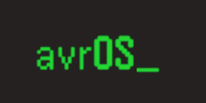

[](https://github.com/racerxr650r/avrOS)
---
# avrOS Getting Started

**avrOS** - _Operating Environment for AVR DA_, is a scalable operating environment 
including drivers for the AVR DA family of microcontrollers. It provides macros and a 
custom linker script to build the system tables (state machines, drivers, services, 
command line interface callbacks, Events, Queues, and Timers) at compile time. 
Application code defining these objects can be distributed across several source files.
In addition, these tables reside in FLASH where possible and the
system doesn't require run-time registration and related fault handling code.
There is no need to edit a single source file containing all these system tables.

avrOS also provides a makefile and instructions to setup a development
environment and build applications on a Linux desktop PC, chromebook, or even a
Raspberry PI. There's no need to use Atmel Studio and Windows for AVR application
development.

avrOS provides the following system objects and services:

* Finite State Machine manager (fsm)
* Extensible Command Line Interface (cli)
* Logger (log)
* Memory usage API (mem)
* Pulse Code Modulated sound player API (pcm)
* Flags API (flg)
* Queues API (que)
* Timers API (tmr)
* Events (evnt)

It also provides the following AVR DA device drivers:

* GPIO
* UART
* System Tick (16 bit Timer Type B)
* DAC
* Internal CPU Oscillator API

Lastly, it also includes a Linux command line utility `wav2c` to convert a 
number of sound and video file formats to a C file that can be linked with
your application and played with the PCM sound player API.

avrOS is still in it's sub 1.0 development stage. So there are lots of new 
features and drivers coming. For more information regarding avrOS, refer to
the [User Manual](./doc/MANUAL.md).

For an example of Raspberry Pi 4 based development environment, see the
[Raspberry PI 4 model B Development Platform](./doc/PI4_Dev_Station.md) document.

## Install Development Environment and Build

avrOS is developed on a Linux workstation using the avr-gcc compiler, gnu make,
and avrdude w/Atmel Ice jtag programmer. To recreate this development 
environment on a debian based Linux distribution follow the instructions here:

1. From your "Projects" directory, clone avrOS from github

    ```console
    git clone https://github.com/racerxr650r/avrOS.git
    ```
   
   You will find these instructions in ./avrOS/README.md included in the project
   files from git. In addition, ./.vscode/c_cpp_properties.json configuration file
   is included with the project. This file will setup the visual studio code C/C++ intellisense to find all the appropriate include directories and files.

2. For an automated installation, run the provided install script and then goto step #9.
   Else if you prefer a manual installation, skip to the next step.

   > :memo: **Note:** This automated script will install additional tools such as minicom, gtkterm, geany, vscode, git-cola, meld, and others.
   I encourage you to review the script before running it.

    ```console
    cd avrOS
    ./install-tools.sh
    ```
       
3. Install Gnu make, git, avr-gcc Gnu C compiler, and other tools

    ```console
    sudo apt install make git binutils gcc-avr avr-libc flex byacc bison unzip
    ```
    
4. Download the Microchip Device Family Pack for the Atmel-Dx series from the [Microchip Packs Repository](http://packs.download.atmel.com/)

   ```console
   wget http://packs.download.atmel.com/Atmel.AVR-Dx_DFP.2.2.253.atpack
   ```

5. Extract the `Atmel.AVR-Dx_DFP.2.2.253.atpack` file locally and copy it to the `/usr/lib/gcc/avr/5.4.0` directory

    ```console
    mkdir ./Atmel.AVR-Dx_DFP.2.2.253
    unzip -d Atmel.AVR-Dx_DFP.2.2.253/ Atmel.AVR-Dx_DFP.2.2.253.atpack
    sudo cp -R Atmel.AVR-Dx_DFP.2.2.253/ /usr/lib/gcc/avr/5.4.0
    rm -rf Atmel.AVR-Dx_DFP.2.2.253
    rm Atmel.AVR-Dx_DFP.2.2.253.atpack
    ```

6. Install AVRDUDE from sources on github

    Go to this [AVRDUDE github page](https://github.com/avrdudes/avrdude/wiki/Building-AVRDUDE-for-Linux)
    for instructions to clone, build, and install it from the latest source

    I recomend this version because the version in the Debian/Ubuntu package
    repository does not include support for the Atmel Ice and it's UPDI programming
    interface.

7. Build avrOS example application

    Goto the application directory and make the .hex image

    ```console
    cd avrOS/app/avrOS_example
    make
    ```

8. Program the .hex image into the MCU flash [^1] [^2]

    ```console
    make flash
    ```
    
    The default programmer defined in the makefile is the Atmel ICE.

9. Setup your git username and email

    If you haven't already, you should setup your git username and email address
    using the following commands.

    To setup your username:

    ```console
    git config --global user.name "John Doe"
    ```

    To setup your email:

    ```console
    git config --global user.email "john_doe@gmail.com"
    ```
    
These instructions are similar for Fedora and MacOS. You'll need to use the
appropiate package manager.

[^1]: The make flash target will build and program the application into flash
[^2]: If you are using a different programmer that is supported by AVRDUDE, 
change PRG in the makefile to the string AVRDUDE uses for your programmer
