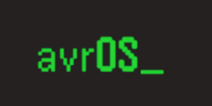

[](https://github.com/racerxr650r/avrOS)
---

**avrOS** - _Operating Environment for AVR DA_, is a scalable operating environment 
including drivers for the AVR DA family of microcontrollers. It uses the Gnu
linker to build the system tables (state machines, states, drivers, services,
CLI callbacks, Flags, Queues, and Timers) at compile time. So these tables
reside in FLASH where possible and the system doesn't require registration and
related fault handling code. avrOS provides a set of macros to build these
tables. So code related to the user application can be distributed across
several source files. There is no need to edit a single source file containing
these system tables.

avrOS also comes with a makefile and instructions to setup a development
environment and build applications on a Linux desktop PC. No need to use Atmel
Studio and Windows for application development.

avrOS provides the following system objects and services:

* Finite State Machine manager (fsm)
* Command Line Interface (cli)
* Logger (log)
* Memory usage API (mem)
* Pulse Code Modulated sound player API (pcm)
* Flags API (flg)
* Queues API (que)
* Timers API (tmr)

In addition, it also includes the following AVR DA device drivers:

* UART
* System Tick (16 bit Timer Type B)
* DAC
* Internal CPU Oscillator API

Lastly, it also includes a Linux command line utility `wav2c` to convert a 
number of sound and video file formats to a C file that can be linked with
your application and played with the PCM sound player API.

avrOS is still in it's early development stage. So there are lots of new 
features and drivers coming.

## Microcontroller Resources

RAM is a precious commodity on microcontrollers. Especially for 8 bit 
microcontrollers like the AVR. The AVR DA family only has 16K of RAM. 
Therefore, avrOS is designed to use as little RAM as possible.

Classic realtime operating systems use threaded multitasking. The OS has a 
scheduler that controls which thread is currently running. The scheduler uses a
thread priority value to determine which thread runs next. To implement the 
thread context, each thread has it's own stack. The stack is stored in RAM and
is used for passing and returning values and storing local variables for 
functions. This same stack also stores the context for any interrupts that 
happen during the thread execution. The scheduler then points the CPU stack
register to the scheduled thread stack to implement a context switch. With 
multiple threads, this requires reserving enough RAM for the deepest call stack
plus the largest interrupt context for each thread. This is not the efficient
use of RAM. A more efficient approach would use a single stack for all 
"threads".

Another feature of classic realtime operating systems is a modular design that 
organizes code into functional blocks. Each block represents a black box. The 
application code that uses these blocks interacts with the black box through 
a defined API. To abstract the data structures that represent the instance of
an object a block implements, classic operating systems dynamically allocate
memory at runtime to store these data structures. In practice, significant
portions of these data structures are populated with constant values. Reading
constant data from ROM/Flash memory to initialize an object at runtime requires
the functional block to allocate memory from RAM. This is another inefficient
use of RAM. It also requires additional code to test and handle the condition
when not enough RAM is available.

## avrOS Theory of Operation

To use RAM as efficiently as possible, avrOS implements a type of cooperative
multitasking. This requires that the application code does not block or busy
wait. Instead it will check the status of various variables or objects to 
detemine if it should do something, do it, and then return. By doing this,
avrOS is able to use a single stack for all the system threads and interrupt 
contexts.

avrOS does not implement threading. The AVR microcontrollers have a very rich
set of interrupts to handle asynchronous events. Handlers for these interrupts
are "scheduled" asynchronously by the AVR interrupt controller. avrOS objects
such as flags and queues can be used by the handler to signal and pass data to
the user application code.

In addition, the avrOS scheduler uses a finite state machine paradigm. The user
application and system services register state machines and a set of states.
The finite state machine manager (fsm) provides an API for the developer to
control the state progression of the state machine. The scheduler uses a table
of state machines and states to determine which to call next. The constant data
in these tables is stored in FLASH. Only the dynamic state information is
stored in RAM. 

These tables are built at compile time and the linker determines that there is
enough FLASH and RAM to store them. Therefore, there is no need for user code
to call APIs to create objects at runtime and include additional code to handle
conditions when there is not enough RAM to create a new object.

To enable this feature and maintain an object oriented approach to software
development, avrOS provides a set of macros for user code to declare objects.
These macros "allocate" instances of state machines, states, queues, flags,
timers, CLI commands, alarms, etc. at compile time.

Lastly, avrOS is highly scalable. Using the avrOSConfig.h file, an application
developer can select precisely the features and drivers required by their
implementation. For instance, a debug version of application may include the
CLI and Logger services. But, the release version of the same application may
not include either of these services.

## Organization and Building

avrOS is organized into 5 directories counting the root directory; ./sys,
./drv, ./srv, and ./app/avrOS_example. The root directory contains the
avrOS.h header file. The ./sys directory contains the source files that
implement system initialization, the finite state machine manager, and the OS
objects (flags and queues). The ./drv directory contains the device drivers.
The ./srv contains the system services such as the CLI manager and Logging.
And, the ./app/avrOS_example directory contains the makefile, avrOSConfig.h,
main.c, and avrOS.x files. The avrOSConfig.h file selects the components to
be included in the build. The avrOS.x file is a linker script. The main.c
file contains the main() entry point and the user application state machine
and system objects.

An application is built from the ./app/application_name directory. avrOS
comes with a ./app/avrOS_example directory and application code examle.
To create your own application, make a new directory in ./app directory.
Copy the makefile, avrOS.x, avrConfig.h, and main.c files from the 
./app/avrOS_example to your new directory. 

The makefile will build your without any changes. If you choose to rename
main.c, you will have to modify the PRJ variable in the makefile to the same
name of your renamed main.c file excluding the .c file extension.

The avrOS.x file is the linker script for your application. avrOS is dependent
on this linker file. Do not replace it with a standard linker script without
updating it to include the required sections and symbols. For more
information regarding this, see the *avrOS Linker Script* page in the avrOS
wiki.

The avrConfig.h file configures the system, driver, and service files to be
included with your application. It's self documenting with a signficant
number of comments included in the file.

The main.c soure file is the entry point for your application. It contains
main(). Main calls sysInit() to perform the runtime initialization of avrOS.
It then enters an endless while loop calling fsmDispatch() and sysSleep().
This function implements the finite state machine scheduler. This scheduler
walks the state machine and state tables to determine which state to run.
The scheduler will continue to call states until the "ready" queue is empty.
At that time, it will return. The loop in main() then calls sysSleep(). This
function puts the processor into a sleep state and stops execution.
Execution will resume and sysSleep() will return once an external interrupt
is triggered. The loop then repeats.

## Development Environment

avrOS is developed on a Linux workstation using the avr-gcc compiler, gnu make,
and avrdude w/Atmel Ice jtag programmer. To recreate this development 
environment on a debian based Linux distribution follow the instructions here:

1. Install Gnu make and git

    ```console    
    sudo apt install make git
    ```

2. Install avr-gcc Gnu C compiler and tools

    ```console
    sudo apt install binutils gcc-avr avr-libc flex byacc bison
    ```

3. Download the Microchip Device Family Pack for the Atmel-Dx series from the [Microchip Packs Repository](http://packs.download.atmel.com/)

    Download the lastest [Atmel AVR-Dx Series Device Support](http://packs.download.atmel.com/#collapse-Atmel-AVR-Dx-DFP-pdsc) DFP

4. Extract the `Atmel.AVR-Dx_DFP.2.2.253.atpack` file locally and copy it to the `/usr/lib/gcc/avr/5.4.0` directory

    From the directory you extracted the DFP use the following command to copy it:

    ```console
    sudo cp -R Atmel.AVR-Dx_DFP.2.2.253/ /usr/lib/gcc/avr/5.4.0
    ```

    If your file manager does not recognize it as a compressed file, add a .zip extension to the filename

    If you extracted/copied it elsewhere, you will need to update DFP to the path of the base directory you just extracted

5. Install AVRDUDE from sources on github

    Go to this [AVRDUDE github page](https://github.com/avrdudes/avrdude/wiki/Building-AVRDUDE-for-Linux)
    for instructions to clone, build, and install it from the latest source

    I recomend this version because the version in the Debian/Ubuntu package
    repository does not include support for the Atmel Ice and it's UPDI programming
    interface.

6. Clone avrOS from github

    ```console
    git clone https://github.com/racerxr650r/avrOS.git
    ```

7. Build avrOS example application

    Goto the application directory and make the .hex image

    ```console
    cd avrOS/app/avrOS_example
    make
    ```

8. Program the .hex image into the MCU flash [^1] [^2]

    ```console
    make flash
    ```
These instructions are similar for Fedora and MacOS. You'll need to use the
appropiate package manager

[^1]: The make flash target will build and program the application into flash
[^2]: If you are using a different programmer that is supported by AVRDUDE, 
change PRG in the makefile to the string AVRDUDE uses for your programmer
