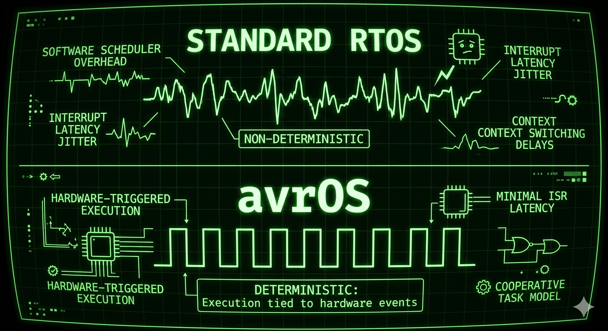
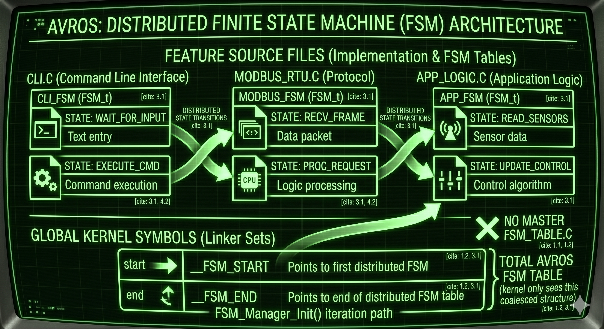
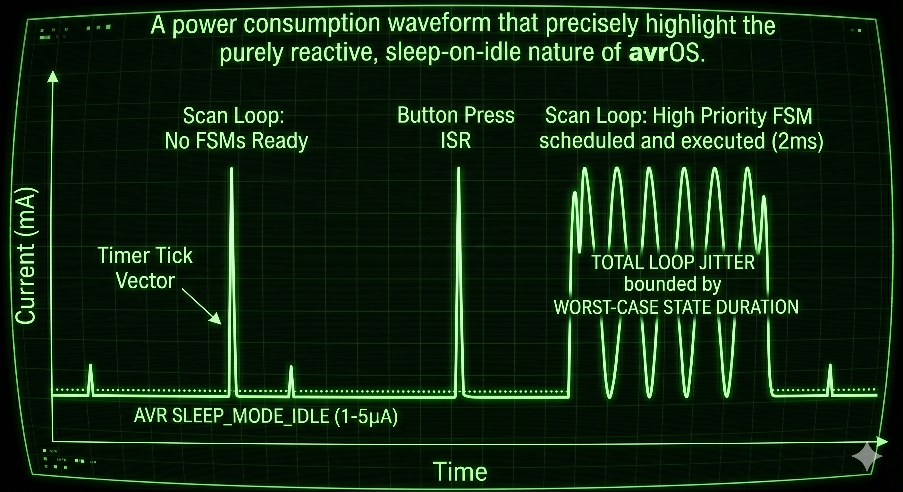

# avrOS: Minimal-Overhead, Event-Driven OS for AVR
---
**avrOS** is a minimalist, single-stack, event-driven operating system designed to extract maximum performance and **maximum determinism** from 8-bit AVR microcontrollers. It is not a traditional RTOS with a complex software scheduler and memory-hungry task stacks; it is a minimalist framework that empowers the developer to be the master of system timing and power efficiency. 

By delegating task switching and power management to the AVR's own hardware, **avrOS** redefines what it means to be a "lean" kernel—ensuring that your application's execution is as predictable as the silicon itself.

---
## Core Principles and Architecture

### 1. Hardware-Centric Task "Switching"
**avrOS** eliminates the biggest RAM and CPU cost in an RTOS: **software context switching**.
* **One Stack:** The entire system—including all state machines and ISRs—runs on a single shared stack. This makes the most efficient use of the limited SRAM found on AVR microcontrollers.
* **No Software Scheduler:** **avrOS** does not have a "tick" or a complex task manager. Instead, it relies on the AVR's robust **hardware interrupt controller** to handle all preemption and priority management. An interrupt triggers a vector, which is the ultimate, minimal latency "context switch."

### 2. Decentralized, Prioritized Initialization (Linker Sets)
System modularity is achieved through a **static allocation model** using custom linker sections.
* **Distributed Tables:** Developers can declare Finite State Machines (FSMs), drivers, and events in multiple, separate source files. The GCC linker automatically collects and coalesces these declarations into a single contiguous table at build time.
* **No Central "Master" List:** This "Linker Set" pattern decouples files, simplifying development and maintenance.
* **Static Initialization:** During the Initialization (Startup) phase, the kernel walks this prioritized table once, calling initialization functions to set up the hardware before any runtime code executes. This mirrors the "Configuration Table" concept of safety-critical systems like ARINC 653.

### 3. Purely Responsive, Event-Driven FSM
The heart of **avrOS** is a **prioritized scan loop** that moves FSMs between specialized queues.
* **Stateful Event Pipeline:** Events are managed in their own prioritized queues and exist in one of three states: **Disarmed**, **Armed**, or **Triggered**.
* **FSM Dispatcher:** The FSM kernel walks the prioritized **Ready Queue**. It executes a single, concise, non-blocking state function ("continuation") per "ready" state machine and then returns control to the dispatcher. This continues until there are no FSMs in the Ready queue. At this time, the FSM dispatcher returns to the application's main loop where it can implement sleep management via an avrOS provided API.
* **Rescheduling on Event:** When an event is triggered (e.g., from an ISR), the FSM schedules the corresponding state machine. To ensure responsiveness, if a higher-priority FSM is made ready, the dispatcher **resets to the top** of the queue, ensuring the most critical code runs next.

### 4. The "Race to Sleep" Power Model
**avrOS** prioritizes efficiency. Power consumption is directly proportional to event density.
* **"Sleep on Idle" Loop:** The main application loop is exceptionally lean. It dispatches all work until the Ready Queue is empty, then calls the processor’s `sleep` instruction.
* **Zero Polling:** The CPU does not pace, poll, or check status while idle. It sleeps, consuming minimal power, and is woken only by a hardware interrupt.
* **Developer Control:** **avrOS** exposes the `main()` loop to the developer, providing ultimate flexibility. The developer has total control over which sleep mode to use and when, allowing for precise dynamic power scaling based on application needs.

### 5. Developer-Controlled Determinism (Correctness by Construction)
Determinism in **avrOS** is not an OS variable; it is a direct reflection of application code quality.
* **Run-to-Completion:** All state functions must be concise and non-blocking. Large algorithms must be broken into "manageable chunks" that fit within a single scan cycle.
* **No Priority Inversion:** To keep the RAM footprint tiny and the code simple, **avrOS** uses fixed priority. The system relies on the developer to manage timing through task decomposition and stateful transitions.
* **Total Transparency:** This model removes all "magic" from the scheduler, providing 100% predictable execution. If a state transition must happen in a specific window, the developer has the direct visibility needed to ensure it does.
---
## Project Status and Additional Resources
avrOS is still in it's sub 1.0 development stage. So there are lots of features 
and drivers still under development.

For more information regarding avrOS, refer to [Getting Started](./doc/Getting_Started.md) and [User Manual](./doc/MANUAL.md).

For an example of Raspberry Pi 4 based development environment, see the
[Raspberry PI 4 model B Development Platform](./doc/PI4_Dev_Station.md) document.