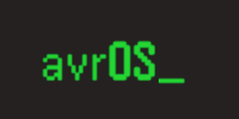

[](https://github.com/racerxr650r/avrOS)
---
# User Manual
***avrOS*** - _Operating System for AVR DA_, is a scalable operating system 
including drivers for the AVR DA family of microcontrollers. It uses macros, a 
custom linker script, and the linker to build the system tables (state machines,
states, drivers, services, CLI callbacks, Events, Queues, and Timers) at compile/link 
time. There is no need to edit a single source file containing all these system
tables. Application code defining these objects can be distributed across several
source files. In addition, these tables reside in FLASH where ever possible and the
system does not require run-time registration and related fault handling code.
Reducing the use of RAM.

In addtion, the scheduler implements a state machine paradigm using cooperative
multi-tasking to optimize the system stack. The user does not need to carve up
the system stack for each thread context. This further optimizes the use of
precious RAM and/or improves latency when handling hardware interrupts.

## avrOS File Organization
avrOS is organized into 7 directories counting the root directory; ./, ./app,
./docs, ./drv, ./srv, ./sys, and ./util

```console
avrOS
+-- app
|   +-- avrOS_example
+-- doc
|   +-- images
+-- drv
+-- srv
+-- sys
+-- util
    +-- wav2c
```
***.../avrOS*** Root contains the avrOS.h header file. 

***avrOS/app/avrOS_example*** contains the makefile, avrOSConfig.h, main.c, and avrOS.x
files. The avrOSConfig.h file selects the components to be included in the
build. The avrOS.x file is a linker script. The main.c file contains the main()
entry point and the user application state machine and system objects.

***avrOS/doc*** contains relavent documents and graphic files. This includes the document
you are reading now and the avrOS logo graphic files.

***avrOS/drv*** contains the device drivers.

***avrOS/srv*** contains the system services such as the CLI manager and Logging.

***avrOS/sys*** contains the source files that implement system initialization, the
finite state machine manager, and the OS objects (flags and queues). 

***avrOS/util*** contains host utility programs.

### app (Application)
The avrOS/app directory contains a sub-directory for each application. The
app directory should contain at least the following files.

***avrConfig.h*** configures the system, driver, and service files to be
included with your application. It's self documenting with a signficant
number of comments included in the file.

***avrOS.x*** is the linker script for your application. avrOS is dependent
on this linker file. Do not replace it with a standard linker script without
updating it to include the required sections and symbols. For more
information regarding this, see the *avrOS Linker Script* page in the avrOS
wiki.

***main.c*** source file contains the entry point `main()` for your application.
Main calls `sysInit()` to perform the runtime initialization of avrOS. It then
enters an endless while loop calling `fsmDispatch()` and `sysSleep()`. This
function implements the finite state machine scheduler. This scheduler walks
the state machine and state tables to determine which state to run. The
scheduler will continue to call states until the "ready" queue is empty. At
that time, it will return. The loop in `main()` then calls `sysSleep()`. This
function puts the processor into a sleep state and stops execution. Execution
will resume and `sysSleep()` will return once an external interrupt is triggered.
The loop then repeats.

***makefile*** is the make script to build, clean, and flash your application.

### sys (System)
avrOS provides the following system objects and functions:

* Finite State Machine manager (fsm)
* Memory usage API (mem)
* Events API (evnt)
* Queues API (que)
* Timers API (tmr)

### srv (Services)
avrOS provides the following system services:

* Command Line Interface (cli)
* Logger (log)
* Pulse Code Modulated sound player API (pcm)

### drv (Drivers)
avrOS provides the following AVR DA device drivers:

* UART
* System Tick (16 bit Timer Type B)
* DAC
* Internal CPU Oscillator API

###  util (Utilities)
avrOS includes a Linux command line utility `snd2c` to convert a 
number of sound and video file formats to a C file that can be linked with
your application and played with the PCM sound player API.

## Install the host tools to target the AVR microcontroller
Go to the `.../avrOS` directory and run the following command to set the
environment variable used by the install scripts to locate files in the
appropriate directory.

```console
export AVROSHOME=$(pwd)
```

Then run the applicable install script(s) found in the `$AVROSHOME/util/scripts`
directory. The following table describes each of these scripts

   | Script               | Description                                     |
   |----------------------|-------------------------------------------------|
   | install_cli_tools.sh | Installs the required command line tools (gcc, binutils, avrdude, tio, Microchip Device Family Pack, etc.), builds the example application, and sets up git |
   | install_gui_tools.sh | Installs a set of helpful GUI development tools (geany, git-cola, meld, gtkterm, and vscode) |
   | install_all_tools.sh | Installs both the CLI and GUI tools mentioned above |
   | install_remote_pi.sh | Installs the command line tools (plus btm), sets up configurations for tio, tmux, and bash, and configures the /boot/config.txt to enable serial console and uarts 2, 3, and 4. This script should only be run on a Raspberry Pi intended for headless remote development. See the [Raspberry PI 4 model B Development Platform](./doc/PI4_Dev_Station.md) document for more details |
   | install_avrdude.sh   | Downloads, boulds, and installs avrdude from the latest version on github |
   | setup_git.sh         | Prompts and configures the username and email for git. install_cli_tools.sh calls this script |

>[!NOTE]
>These automated scripts will install additional software
>packages and possibly update config files. It's good practice to review
>these scripts before running any of them.

## Create a New Application Project Directory
To create a new project, goto the `.../avrOS/app/avrOS_example` directory and run
the following make command.

```console
make project
```

This will create a new application project directory in the `.../avrOS/app`
directory. The new directory will be named `project`. This directory can be
remaned.

Optionally, you can use the following command to create the new project
directory with the provide name.

```console
make project NAME=new_directory_name_here
```

Once the new project directory is created, it will contain a base main.c source
file, makefile, avrOSConfig.h file, and avrOS.x linker file. These are based on
the example application. You may begin modifying main.c and adding new source
files as needed.

If you choose to rename main.c, you will have to modify the `PRJ` variable in
the makefile to the same name of your renamed main.c file excluding the .c file
extension.

## Programming and Running avrOS Application
By default, it uses the Atmel Ice as the programmer.
To change this, modify the PRG variable in the makefile.

```
# avr programmer (and port if necessary)
# e.g. PRG = atmelice_updi -or- PRG = serialupdi -P /dev/ttyUSB0
# The current programmer if the Atmel ICE w/UPDI interface
PRG = atmelice_updi
```

`make flash` will program the application .elf file into the AVR flash program
memory and reset the processor.

`make test` will test the connectivity to the programmer.

## Build, Program, and Run an Application
To build an application, goto the `.../avrOS/app/app_directory_name_here`
directory. avrOS comes with a `.../avrOS/app/avrOS_example` application
example. From this application directory, run the following command.

```console
make all
```

This will build the application .elf file. The generated object and binary
files will be found in the newly created `./build` directory.

The makefile uses [AVRDUDE](https://github.com/avrdudes/avrdude/wiki/Building-AVRDUDE-for-Linux)
to program the target CPU. The following commands program various memory areas
of the AVR controller. To use these commands in your environment, you will need
to set the `PRG` variable in the makefile. By default, this is set to use the
`/dev/ttyAMA2` serial port and the `serialupdi` interface to program the device
using the UPDI pin. The hardware to enable this is a 1k resistor wired inline on
the Tx line that is then shorted to the Rx line. See [this manual entry](https://avrdudes.github.io/avrdude/7.3/avrdude_21.html)
on the avrdudes github page for more details.

If you are using another device such as the Atmel ICE to program the controller,
you'll need to look up the appropriate avrdude flag(s). In the case of the 
Atmel ICE, `PRG` should be set to `atmelice_updi`.

To confirm that the `avrdude` programmer flag and the hardware is setup
correctly, run the following command.

```console
make test
```

This command confirms that `avrdude` is able to connect to the controller and
read the various memory spaces. A successful connection will generate output
that is similar to this.

```console
$ make test
/usr/bin/avrdude -c serialupdi -P /dev/ttyAMA2 -p avr128da28 -v

avrdude: Version 7.1
         Copyright the AVRDUDE authors;
         see https://github.com/avrdudes/avrdude/blob/main/AUTHORS

         System wide configuration file is /etc/avrdude.conf
         User configuration file is /home/john/.avrduderc
         User configuration file does not exist or is not a regular file, skipping

         Using Port                    : /dev/ttyAMA2
         Using Programmer              : serialupdi
         AVR Part                      : AVR128DA28
         RESET disposition             : dedicated
         RETRY pulse                   : SCK
         Serial program mode           : yes
         Parallel program mode         : yes
         Memory Detail                 :

                                           Block Poll               Page                       Polled
           Memory Type Alias    Mode Delay Size  Indx Paged  Size   Size #Pages MinW  MaxW   ReadBack
           ----------- -------- ---- ----- ----- ---- ------ ------ ---- ------ ----- ----- ---------
           fuse0       wdtcfg      0     0     0    0 no          1    1      0     0     0 0x00 0x00
           fuse1       bodcfg      0     0     0    0 no          1    1      0     0     0 0x00 0x00
           fuse2       osccfg      0     0     0    0 no          1    1      0     0     0 0x00 0x00
           fuse4       tcd0cfg     0     0     0    0 no          1    1      0     0     0 0x00 0x00
           fuse5       syscfg0     0     0     0    0 no          1    1      0     0     0 0x00 0x00
           fuse6       syscfg1     0     0     0    0 no          1    1      0     0     0 0x00 0x00
           fuse7       codesize    0     0     0    0 no          1    1      0     0     0 0x00 0x00
           fuse8       bootsize    0     0     0    0 no          1    1      0     0     0 0x00 0x00
           fuses                   0     0     0    0 no          9   16      0     0     0 0x00 0x00
           lock                    0     0     0    0 no          4    1      0     0     0 0x00 0x00
           tempsense               0     0     0    0 no          2    1      0     0     0 0x00 0x00
           signature               0     0     0    0 no          3    1      0     0     0 0x00 0x00
           prodsig                 0     0     0    0 no        125  125      0     0     0 0x00 0x00
           sernum                  0     0     0    0 no         16    1      0     0     0 0x00 0x00
           userrow     usersig     0     0     0    0 no         32   32      0     0     0 0x00 0x00
           data                    0     0     0    0 no          0    1      0     0     0 0x00 0x00
           eeprom                  0     0     0    0 no        512    1      0     0     0 0x00 0x00
           flash                   0     0     0    0 no     131072  512      0     0     0 0x00 0x00

         Programmer Type : serialupdi
         Description     : SerialUPDI

avrdude: device is in SLEEP mode
avrdude: NVM type 2: 24-bit, word oriented write
avrdude: entering NVM programming mode
avrdude: AVR device initialized and ready to accept instructions
avrdude: device signature = 0x1e970a (probably avr128da28)
avrdude: leaving NVM programming mode

avrdude done.  Thank you.
```

To program the contoller fuses, run the following command.

```console
make fuses
```

This command will run `avrdude` to program the controller's fuses.

To program the controller lock bits, run the following command.

```console
make lock_bits
```

This command runs `avrdude` to program the controller's lock bits.

To program the application binary into microcontroller flash memory, reset the
controller, run the application, type the following command from the same
directory you ran the prior make command.

```console
make flash
```

This command will run `avrdude` to program the controller's flash memory.

## avrOS Application Development
As previously mentioned, avrOS builds a series of tables that describes the OS
and driver configuration. These tables are stored in non-volatile flash memory
wherever possible. To facilitate this, avrOS provides macros to declare and
define OS objects, services, and drivers. The following sections describe the
various OS modules and drivers, how to declare and define them, and API to use
them in your application.

### System
System provides the functions that initialize the system, manage the system
tick, and put the system to sleep. These are used in the application code that 
implements the system loop.

```C
// Application entry point and system loop ------------------------------------
int main(void)
{
    // Initialize the system --------------------------------------------------
    sysInit();
    // *** Insert custom initialization code here ***
    // Loop forever -----------------------------------------------------------
    while (1) 
    {
        // Call the main state machine dispatcher
        fsmDispatch();
        // *** Insert custom logic prior to going asleep here ***
        // Go to sleep until the next interrupt
        sysSleep();
        // ** Insert custom logic after awaking here ***
    }
}
```
`sysInit()` initializes all of the system objects, services, and device drivers. The
while loop implements the system run time. The `fsmDispatch()` function implements
the finite state machine. This function will step through all the of the state
machines in the ready queue in priority order calling the current state function for
each. The function only returns when there are no longer any state machines in the
ready queue. This implies that all of the state machines have either ended and/or
they are waiting on an event.

>[!NOTE]
>Events are important to system power management. All state machines must eventually
>wait on an event if the system is to go into sleep mode. If there is just one state
>machine that does not wait on an event, the system will never go into sleep mode.

### Finite State Machine
The state machine dispatcher in avrOS maintains a table of state machine descriptors
in flash. This table is built using the `ADD_STATE_MACHINE()` macro in the user code.
These data structures maintain the name of the state machine, a pointer to a state
machine status data structure in RAM, a pointer to the initialization function for
that state machine, the state machine's priority, and a void pointer that can be used
to point to a customer data structure with additional user information related to the
state machine. The state machine status data structure in RAM contains a pointer to
the current state, a pointer to the next state, a boolean that notes if this is the
first call to this state since the prior state change, a tick count for a wait timer
event, a next pointer used for the ready and wait queues, and a pointer back to the
descriptor in flash described above. State transitions are handled in the state code
itself by calling `fsmSetNextState(state_machine_name, state_function_pointer)`.

The code to implement a state machine looks something like this.

```C
// My State Machine Configuration ------------------------------------------------
ADD_STATE_MACHINE(My_State_Machine_Name,MyStateMachineInit, FSM_APP | 10);
 
int MyStateMachineInit(volatile fsmStateMachine_t *stateMachine);
int MyState1(volatile fsmStateMachine_t *stateMachine);
int MyState2(volatile fsmStateMachine_t *stateMachine);
int MyState3(volatile fsmStateMachine_t *stateMachine);
 
// My State Machine Status --------------------------------------------------------
int MyStatus;
 
// My State Machine Initialization ------------------------------------------------
int MyStateMachineInit(volatile fsmStateMachine_t *stateMachine)
{
    // Do something here
    blah blah blah;
 
    MyStatus = GOTO_STATE_2;
    fsmSetNextState(stateMachine,MyState1);
    return(0);
}
 
int MyState1(volatile fsmStateMachine_t *stateMachine)
{
    // Do Something here
    blah blah blah;
 
    // If this is the second call to this state since the last transition...
    if(!fsmIsInitialCall())
    {
        if(MyStatus == GOTO_STATE_2)
            fsmSetNextState(stateMachine,MyState2);
        else if(MyStatus == GOTO_STATE_3)
            fsmSetNextState(stateMachine,MyState3);
    }
 
    // Wait for 250 systems ticks (250 mSec)
    fsmWaitTicks(stateMachine, 250);
    return(0);
}
 
int MyState2(volatile fsmStateMachine_t *stateMachine)
{
    // Do Something here
    blah blah blah;
    MyStatus = GOTO_STATE_3;
 
    fsmSetNextState(stateMachine,MyState1);
 
    // Wait for 250 systems ticks (250 mSec)
    fsmWaitTicks(stateMachine, 250);
    return(0);
}
 
int MyState3(volatile fsmStateMachine_t *stateMachine)
{
    // Do Something here
    blah blah blah;
    MyStatus = GOTO_STATE_2;
 
    fsmSetNextState(stateMachine,MyState1);
 
    // Wait for 250 systems ticks (250 mSec)
    fsmWaitTicks(stateMachine, 250);
    return(0);
}
```
In the code above, `MyStateMachineInit()` is called once during the `sysInit()`
called from the application `main()`; [See System](#system)). Each
state tells the state machine dispatcher to wait for 250 milliseconds before
calling the next state. And, `MyState1()` is called twice each time because it
checks if this is the initial call to this state since the last state transition.

### Events

### Queues

### Lists

### Alarms
***Future Feature***

### Memory Pools
***Future Feature***

### Command Line Interface
The Command Line Interface (cli) uses one of the serial ports and is enabled with
the following commands. It provides an easy to implement User interface, a mechanism
to aid debugging, and a simple way to analyze system performance.

```C
ADD_UART_RW(cliUart, CLI_USART, CLI_BAUDRATE, CLI_PARITY, CLI_DATA_BITS, CLI_STOP_BITS, CLI_TX_QUEUE_SIZE, CLI_RX_QUEUE_SIZE);
ADD_CLI(command_line,UART_FILE_PTR(cliUart));
```
Once the UART and CLI has been setup, the following will add a user specified CLI
command. myCmd will be called when the user of the CLI types mycmd at the command
prompt. Any arguments after mycmd will be passed to the function as well. In this
case, argc and argv work just like they do for main(). Just like the
ADD_STATE_MACHINE() macro, you can add CLI commands in any source file. The linker
collects the commands from the various source files and builds the CLI command
table.
```C
ADD_COMMAND("mycmd",myCmd,true);
 
int myCmd(int argc, char *argv[])
{
    int err_state = 0;
 
    // Do something here using printf or other stdio output to stdout.
    // Since the third parameter in the ADD_COMMAND() is true, if the CLI user calls mycmd -r
    // myCmd will be called contiously until the user types <cntrl>-C
 
    return(err_state);
}
```
>[!NOTE]
>You can optionally enable CLI commands for any of the drivers or system services you
>include in your app. These commands provide usage stats for that driver or service.
>For instance, you can see the number of bytes sent/received by the UART(s) or the
>number of different errors detected by the UART(s). There's a command to get the
>current and max usage of the system's queues. Lastly, there's a memory commands to
>report the flash and RAM usage including the max stack usage.

Typing `help` or `?` from the avrOS command line will list all of the enabled CLI
commands compiled in the application.
```
avrOS> help
    evnt (-r)
    fsmReset 
    fsmStart 
    fsmStop 
    fsm (-r)
    que (-r)
    tickFreq 
    tick (-r)
    reset 
    gpioRdOut 
    gpioRdIn (-r)
    gpioWrOut 
    gpioTgl 
    gpioClr 
    gpioSet 
    gpio (-r)
    rom (-r)
    ram (-r)
    uart (-r)
    clear 
    ? 
    help 
OK
avrOS> 
```
In the example of the help command above, some of the commands have `(-r)` postpended.
These commands passed `true` as the third parameter in the `ADD_COMMAND()` macro call.
This means the command can be called with a `-r` flag. When this is done, the CLI will
call the command function repeatedly until the user presses `<cntrl>-C`. An example is
the `que -r` command.
```
cliUart_RxQue        Capacity:        8 Max:       1
	In:      79	Out:      79	Overflow:       0
cliUart_TxQue        Capacity:     1024 Max:     498
	In:  458342	Out:  458218	Overflow:       0
logUart_TxQue        Capacity:      255 Max:     211
	In:    1408	Out:    1408	Overflow:       0
evntQue              Capacity:        4 Max:       4
	In:419360630	Out:419360626	Overflow:    6396

<<< Press [Ctrl-C] to return to command prompt >>>
```

### Logging

### Testing

### Modbus
***Future Feature***

### General Purpose I/O

### UART Serial Interface

### Memory Usage Diagnostics

## avrOS Theory of Operation
### The Problem
RAM is a precious commodity on microcontrollers. Especially for 8 bit 
microcontrollers like the AVR. The AVR DA family only has 16K of RAM. 
Therefore, avrOS is designed to use as little RAM as possible.

Classic realtime operating systems use threaded multitasking. The OS has a 
scheduler that controls which thread is currently running. The scheduler uses a
thread priority value to determine which thread runs next. To implement the 
thread context, each thread has it's own stack. The stack is stored in RAM and
is used for passing and returning values and storing local variables for 
functions. This same stack also stores the context for any interrupts that 
happen during the thread execution. The scheduler then points the CPU stack
register to the scheduled thread stack to implement a context switch. With 
multiple threads, this requires reserving enough RAM for the deepest call stack
plus the largest interrupt context for each thread. This is not the efficient
use of RAM. A more efficient approach would use a single stack for all 
"threads".

Another feature of classic realtime operating systems is a modular design that 
organizes the system code into functional blocks. The application code
interacts using an API that declares and defines the objects these functional
blocks implement. To abstract the data structures that represent the instance
of an object and prevent the developer from having to edit system source files
containing arrays of these structures, classic operating systems dynamically
allocate memory at runtime to store these arrays of data structures. In
practice, significant portions of these data structures are populated with
constant values. Reading constant data from ROM/Flash memory to initialize an
object at runtime requires the functional block to allocate memory from RAM.
This is another inefficient use of RAM. It also requires additional code to
test and handle the condition when not enough RAM is available.

### The Solution
avrOS uses an Automata-based programming paradigm. The system scheduler relies
on a cooperative multitasking implementation of the application code. It
implements a finite state machine manager. Instead of threads, it manages a
number of state machines and their states.

To use RAM as efficiently as possible, avrOS implements a form of cooperative
multitasking. This requires that the application code does not block or busy
wait. Instead it will check the status of various variables or objects to 
detemine if it should do something, do it, change state if applicable, notify
the OS that it will wait on an OS event if applicable, and then return. 
By doing this, avrOS is able to efficiently use a single stack for all the 
system threads and interrupt contexts.

avrOS does not implement threading. The AVR microcontrollers have a very rich
set of interrupts to handle asynchronous events. Handlers for these interrupts
are "scheduled" asynchronously and the thread context is stored on the shared 
OS stack by the AVR interrupt controller. avrOS objects such as events and 
queues can be used by the handler to signal and pass data to the user 
application code.

In addition, the avrOS scheduler uses a finite state machine paradigm. The user
application and system services register state machines and a set of states.
The finite state machine manager (fsm) provides an API for the developer to
control the state progression of the state machine. The scheduler uses a table
of state machines and states to determine which to call next. The constant data
in these tables is stored in FLASH. Only the dynamic state information is
stored in RAM. 

These tables are built at compile time and the linker determines that there is
enough FLASH and RAM to store them. Therefore, there is no need for user code
to call APIs to create objects at runtime and include additional code to handle
conditions when there is not enough RAM to create a new object.

To enable this feature and maintain an object oriented approach to software
development, avrOS provides a set of macros for user code to define system
objects. These macros "allocate" instances of state machines, states, queues,
flags, timers, CLI commands, alarms, etc. at compile time and stores much of
the data in flash where it will stay at runtime.

Lastly, avrOS is highly scalable. Using the avrOSConfig.h file, an application
developer can select precisely the features and drivers required by their
implementation. For instance, a debug version of application may include the
CLI and Logger services. But, the release version of the same application may
not include either of these services.

