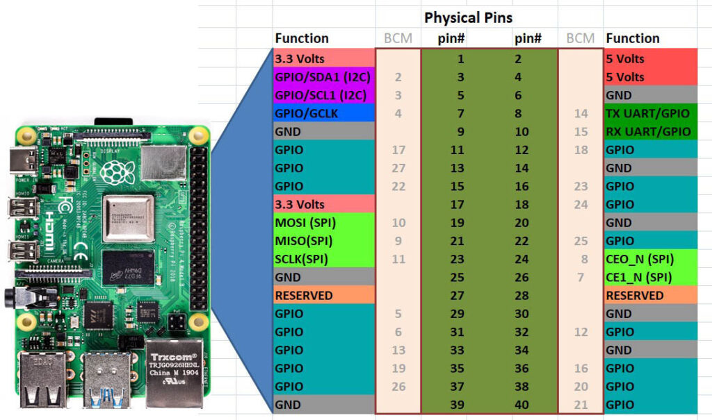
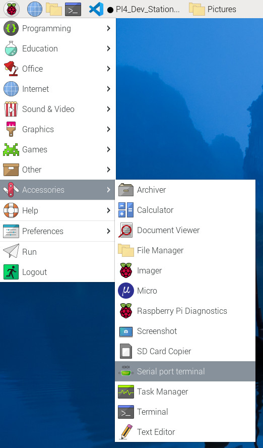
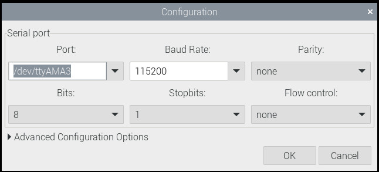
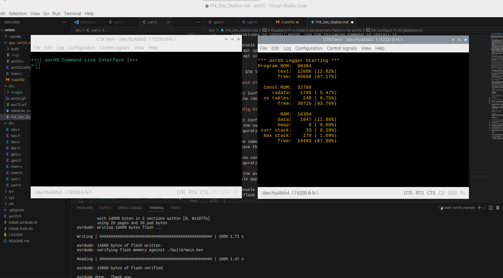

[](https://github.com/racerxr650r/avrOS)
---
# Raspberry PI 4 model B Development Platform for avrOS

The following instructions describe how to assemble and configure a avrOS
development environment using a Raspberry Pi Model B and a solderless
breadboard. By adding an HDMI monitor, keyboard, and mouse, you will have a
complete software/hardware development and debug environment.

## Bill of Materials

1. Raspberry Pi 4 Model B - The PI 4 is required for the additional UART ports.
   Prior models do not have enough ports to support simultaneous console,
   logging, and UPDI programming ports
2. Solderless Breadboard - In this example, I used a breadboard with metal base
   so I could mount the Raspberry Pi to it and make it more mobile. You can
   find many examples for purchase at [Circuit Specialist](https://www.circuitspecialists.com/collections/breadboards) or [Jameco](https://www.jameco.com/c/Prototyping-Systems-Solderless-Breadboards.html)
3. Solderless jumper wires or solid core 24 AWG wire - For wiring the 
   breadboard.
4. AVR128DA28 Microcontroller - AVR microcontroller in a 28 pin dip package.
   You can purchase these from [Digikey](https://www.digikey.com/) or [Mouser](https://www.mouser.com/)
5. Leaded (through hole) 100 nF ceramic capacitor [^1]
6. Leaded (through hole) 10 nF ceramic capacitor [^1]
7. Leaded (through hole) 1 uF ceramic capacitor [^1]
8. 3 Digit LED Voltmeter (Optional) - Included this to verify the voltage
   connected to the power rail on the breadboard.
9. AVR 6-pin ISP breadboard adaptor (Optional) - Available from [Adafruit](https://www.adafruit.com/product/1465?gclid=CjwKCAjw7c2pBhAZEiwA88pOF1L6DqyZab90Mdl54mq7smjS36Chm8jpSfrgYdEkHAi9WPDGRb-lExoCO34QAvD_BwE)
10. Raspberry Pi 4 passive heatsink (Optional) - The one in the pictures below is from
    [Geekworm](https://geekworm.com/products/raspberry-pi-4-11mm-embedded-heatsink-p165-b)
11. Ultra-Small RPi GPIO Status LED & Terminal Block Breakout Board Module (Optional) - 
    I included this to make the build more rugged for portibilty. This can be purchased from [Amazon](amazon.com)
12. M2 Standoffs (Optional) - Used to mount the Pi to the base of the solderless 
    breadboard. There are numerous kits with various sizes of standoffs
    available form [Amazon](amazon.com)

## Assemble the hardware

1. Using standoffs, drill out the metal base of the solderless breadboard and
   mount the Raspberry Pi and 3 digit LED voltmeter


2. Then connect pin 1 from the Pi IO header to the positive power rail of the
   breadboard. Connext pin 9 from the Pi IO header to the negative power rail of
   the breadboard



3. Add jumpers to connect the other power rails on the board

4. Connect both ground pins (15 and 21) on the AVR128DA28 to ground rail

5. Connect Vdd (pin 20) to the power rail (3.3v)

6. Insert the 3 decoupling caps (100nf, 10nf, and 1up) between Vdd and ground 
   (pins 20 and 21)


 > :memo: **Note:** In the image above, I also connected a 6 pin ISP breadboard adaptor for use with the Atmel ICE

 7. Connect Pi UART 2 to the UPDI pin. Connect the Rx (Pi pin 28) to the UPDI port pin
    on the AVR (AVR pin 19). Then connect the Tx (Pi pin 27) to a 1K ohm resistor and
    connect the resistor to the to the UPDI port pin on the AVR (AVR pin 19)


8. Connect Pi UART 3 to the AVR serial console. Connect the Tx pin (Pi pin 7) to the
   AVR UART 2 Rx pin (AVR pin 17). Then connect the Rx (Pi pin 29) to the AVR UART 2
   Tx pin (AVR pin 16)

9. Connect Pi UART 4 to the AVR logging serial port. Connect the Tx pin (Pi pin 24)
   to the AVR UART 1 Rx pin (AVR pin 3). Then connext the Rx pin (Pi pin 21) to the
   AVR UART 1 Tx pin (AVR pin 2)


This is what it should look like when you are done.

## Configure PI OS (Bookworm)

1. Connect the Pi to video, keyboard, mouse, and power. See this
   [Getting Started](https://www.raspberrypi.com/documentation/computers/getting-started.html) guide on the [Raspberry Pi website](https://www.raspberrypi.com/) for
   detailed instruction regarding setting up your Pi and installing the latest
   version of Raspberry Pi OS.

   Power up the Pi. If you haven't already done so, clone [avrOS](https://github.com/racerxr650r/avrOS) and install it according to the intructions in [README.md](../README.md)

2. Edit the configuration file to enable UART2, UART3, and UART4 on the Pi. Open the
   /boot/firmware/config.txt file using an editor (Vim, Nano, Micro etc.). To save the
   file you will need to have root permission. So, open the editor like this

   ```console
   sudo micro /boot/firmware/config.txt
   ```
   Once the file is open, add the following lines to the end of the file.

   ```console
   dtoverlay=uart2
   dtoverlay=uart3
   dtoverlay=uart4
   ```

   Save the file and close the editor.

3. Reboot the Pi and confirm the serial ports are enabled.

   ```console
   ls -l /dev/ttyAMA*
   ```

   You should see the following output

   ```console
   crw-rw---- 1 root dialout 204, 66 Oct 22 11:10 /dev/ttyAMA2
   crw-rw---- 1 root dialout 204, 67 Oct 22 11:11 /dev/ttyAMA3
   crw-rw---- 1 root dialout 204, 68 Oct 22 09:06 /dev/ttyAMA4
   ```

4. Update the avrOS makefile to use the correct serial port for UPDI programming.
   Open the makefile found in the .../avrOS/app/avrOS_example directory with your
   program editor. Find the following lines in the makefile

   ```console
   # avr programmer (and port if necessary)
   # e.g. PRG = atmelice_updi -or- PRG = serialupdi -P /dev/ttyUSB0
   # The current programmer if the Atmel ICE w/UPDI interface
   PRG = atmelice_updi
   ```

   Change the PRG value to the following

   ```console
   PRG = serialupdi -P /dev/ttyAMA2
   ```

   Save the makefile.

5. Setup GTK Terminal to see/use the avrOS console and logging. GTK terminal is
   installed by the install_tools.sh script. If you followed the manual
   instructions to install avrOS, run the following command to install it

   ```console
   sudo apt update
   sudo apt install gtkterm
   ```

   Start GTK Terminal from the Pi accessories menu

   

   Select Configuration | Port from the top menu. In the configuration dialog,
   set the /dev/ttyAMA3

   

   Select Configuration | Save Configuration from the top menu. In this dialog,
   type the name of the configuration (ie. console) and hit <Enter> to save the
   configuration so you can load it later

   Do the same for the logging terminal. This time set the port to /dev/ttyAMA4
   and save the configuration (ie. log)

   Now you can launch two instances of GTK Terminal and load the "console"
   configuration in one and the "log" configuration in the other

6. From the avrOS_example directory run the following command to build the
   example application, load it into the AVR flash memory, and reset the AVR

   ```console
   make flash
   ```
   
   At this point, you should see the user prompt on the console serial terminal
   and the log output on the logging serial terminal.

   

   For more information regarding building, loading, and running avrOS, check out
   the [User Manual](./MANUAL.md).

[^1] - To simplify purchasing, I suggest buying a leaded ceramic capacitor
       kit from [Sparkfun](https://www.sparkfun.com/products/13698), [Digikey](https://www.digikey.com/), [Mouser](https://www.mouser.com/), [Jameco](https://www.jameco.com), or other online source
